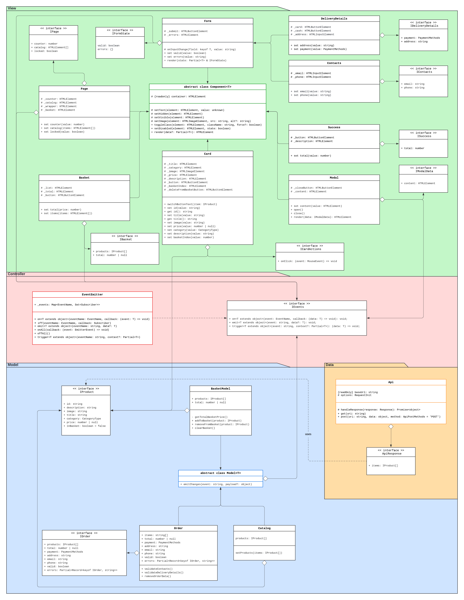

# Проектная работа "Веб-ларек"

Стек: HTML, SCSS, TS, Webpack

Структура проекта:

- src/ — исходные файлы проекта
- src/components/ — папка с JS компонентами
- src/components/base/ — папка с базовым кодом

Важные файлы:

- src/pages/index.html — HTML-файл главной страницы
- src/types/index.ts — файл с типами
- src/index.ts — точка входа приложения
- src/styles/styles.scss — корневой файл стилей
- src/utils/constants.ts — файл с константами
- src/utils/utils.ts — файл с утилитами

## Установка и запуск

Для установки и запуска проекта необходимо выполнить команды

```
npm install
npm run start
```

или

```
yarn
yarn start
```

## Сборка

```
npm run build
```

или

```
yarn build
```

## Особенности архитектуры

Было решено реализовать три слоя:

- `Model` - слой работы с данными
- `View` - слой отображения
- `Controller` - слой управления

В проекте также можно наблюдать классы в папке `base`. Это переиспользуемый базовый код, содержащий классы отображения, модели данных, работы с апи и контроллера. Все компоненты в проекте будут наследоваться от этих классов.

UML-диаграмма:


## Базовые компоненты

### Класс `Api`

Класс `Api` является базовым классом для работы с API. С его помощью отправляются `GET` и `POST` запросы к бэкенду проекта.

**Поля**

- `baseUrl: string` - базовый URL для запросов
- `options: RequestInit` - объект опций для запросов

**Конструктор**

Конструктор класса принимает в качестве аргументов базовый URL для API и объект опций для запросов.

**Методы**

- `handleResponse(response: Response): Promise<object>` - защищенный метод принимает и обрабатывает ответ сервера
- `get(uri: string)` - публичный метод метод принимает URI отправляет `GET` запрос к указанному адресу, ответ запроса обрабатывается при помощи метода `handleResponse` и возвращается `Promise`
- `post(uri: string, data: object, method: ApiPostMethods = 'POST')` - публичный метод принимает URI и данные, которые необходимо отдать на сервер; ответ запроса обрабатывается при помощи метода `handleResponse` и возвращается `Promise`

**Типы и интерфейсы**

- `type ApiListResponse<Type>` - типизация ответа от сервера. Содержит общее число элементов, полученных с бэкенда, а также массив этих элементов заданного типа.
- `type ApiPostMethods` - типизация методов `POST` запросов

### Класс `EventEmitter`

Класс имплементирует интерфейс `IEvents` и представляет собой классическую реализацию брокера событий, выступающего в роли контроллера - связующего звена между моделью и отображением.

**Поля**

- `_events: Map<EventName, Set<Subscriber>>` - приватное свойство, содержащее карту "вид события - набор подписчиков"

**Конструктор**

В конструкторе инициализируется свойство `_events` пустой мапой. При вызове свойств туда будут записываться новые события и подписчики на них.

**Методы**

- `on<T extends object>(eventName: EventName, callback: (event: T) => void)` - публичный метод принимает название события и коллбэк, позволяет подписаться на событие
- `off(eventName: EventName, callback: Subscriber)` - публичный метод принимает название события и коллбэк, позволяет снять обработчик с события
- `emit<T extends object>(eventName: string, data?: T)` - публичный метод принимает название события и опциональные данные, позволяет инициировать событие с данными
- `onAll(callback: (event: EmitterEvent) => void)` - публичный метод принимает коллбэк, позволяет подписаться на все события
- `offAll()` - публичный метод позволяет снять обработчики со всех событий
- `trigger<T extends object>(eventName: string, context?: Partial<T>)` - публичный метод принимает название события и опционально контекст, позволяет создать триггер и инициировать событие

**Типы и интерфейсы**

- `type EventName` - типизация имени события строкой или регулярным выражением
- `type Subscriber` - типизация функции-подписчика на событие
- `type EmitterEvent` - типизация события эмиттера с именем и данными
- `interface IEvents` - интерфейс, необходимый для реализации принципа инверсии зависимостей

### Класс `Component`

Абстрактный класс базового отображения. Обеспечивает базовый функционал работы с DOM-элементами.

**Поля**

- `container` - контейнер, в который помещается компонент интерфейса

**Конструктор**

В конструкторе принимается в качестве аргумента DOM-элемент контейнера, который он сохраняет в защищенном свойстве.

**Методы**

- `toggleClass(element: HTMLElement, className: string, force?: boolean)` - публичный метод, позволяющий переключить класс элемента
- `setText(element: HTMLElement, value: unknown)` - защищенный метод, позволяющий установить текстовое содержимое элемента
- `setDisabled(element: HTMLElement, state: boolean)` - защищенный метод, позволяющий сменить статус блокировки элемента
- `setHidden(element: HTMLElement)` - защищенный метод, позволяющий визуально скрыть элемент
- `setVisible(element: HTMLElement)` - защищенный метод, позволяющий визуально отобразить элемент
- `setImage(element: HTMLImageElement, src: string, alt?: string)` - защищенный метод, позволяющий установить изображение и альтернативный текст
- `render(data?: Partial<T>): HTMLElement` - публичный метод рендера, возвращающий корневой DOM-элемент

### Класс `Model`

Абстрактный класс базовой модели.

**Поля**

- `events: IEvents` - защищенное свойство, хранящее события

**Конструктор**

Переданные в конструктор данные копируются в инстансы класса. Таким образом, для дочерних классов нет необходимости переопределять конструктор.

**Методы**

- `emitChanges(event: string, payload?: object)` - публичный метод, позволяющий сообщить подписчикам о изменении модели

## Модели данных

Было решено реализовать 4 сущности:

- Модель продукта - `Product`
- Модель каталога товаров - `Catalog`
- Модель корзины - `BasketModel`
- Модель данных заказа - `Order`

### Класс `Product`

Наследует абстрактный класс Model, на место дженерика передается интерфейс `IProduct`. Хранит данные о товаре, полученные с сервера, а также флаг о наличии товара в корзине пользователя.

**Поля**

Все свойства являются публичными.

- `id: string` - уникальный идентификатор товара
- `description: string` - описание товара
- `image: string` - картинка товара
- `title: string` - название товара
- `category: CategoryType` - категория товара
- `price: number | null` - цена товара
- `inBasket: boolean` - показывает, находится ли товар в корзине

**Методы**

Поскольку данные о товаре не меняются, методов данный класс не предусматривает.

**Типы и интерфейсы**

- `type CategoryType` - список доступных категорий товаров
- `interface IProduct` - описывает данные о товаре, прилетающие с бэка, содержит те же поля, что класс `Product`

### Класс `Catalog`

Наследует абстрактный класс Model, на место дженерика передается массив объектов, реализующих интерфейс `IProduct`. Хранит данные о всех товарах.

**Поля**

- `products: IProduct[]` - публичное свойство, хранящее массив товаров

**Методы**

- `setProducts(items: IProduct[])` - публичный метод, позволяющий из переданных данных создать инстансы класса `Product` и сохранить в свойство `products`. Также уведомляет подписчиков об изменении модели родительским методом `emitChanges`.

### Класс `BasketModel`

Наследует абстрактный класс Model, на место дженерика передается массив объектов, реализующих интерфейс `IBasket`. Хранит данные о добавленных пользователем в корзину товарах: их список и итоговую сумму к оплате.

**Поля**

- `products: IProduct[]` - публичное свойство, хранящее массив товаров
- `total: number | null` - публичное свойство, хранящее сумму к оплате

**Методы**

- `addToBasket(product: IProduct)` - публичный метод, позволяющий добавить товар в корзину
- `removeFromBasket(product: IProduct)` - публичный метод, позволяющий удалить товар из корзины
- `clearBasket()` - публичный метод, позволяющий очистить корзину
- `getTotalBasketPrice()` - приватный метод, позволяющий получить суммарную стоимость товаров в корзине

### Класс `Order`

Наследует абстрактный класс Model, на место дженерика передается массив объектов, реализующих интерфейс `IOrder`. Хранит все необходимые данные о заказе (см. поля класса), часть которых будет сетаться из модели корзины, часть - вводиться пользователем.

**Поля**

- `items: string[]` - хранит массив айдишников выбранных товаров
- `total: number | null` - хранит сумму заказа
- `payment: PaymentMethods` - хранит способ оплаты
- `address: string` - хранит адрес доставки
- `email: string` - хранит почту пользователя
- `phone: string` - хранит телефон пользователя
- `valid: boolean` - хранит информацию о валидности введенных пользователем данных
- `errors: Partial<Record<keyof IOrder, string>>` - хранит ошибки валидации форм

**Методы**

- `validateContacts()` и `validateDeliveryDetails()` - методы валидации введенных пользователем данных. Эти методы проверяют данные и добавляют события изменения состояния валидации.
- `removeOrderData()` - метод для сброса всех данных заказа

## Отображение

В соответствии с макетом, можно выделить следующие пользовательские сценарии:

1. Главная страница → модалка с карточкой товара → добавить/удалить товар из корзины (кроме бесценного товара) → закрыть модалку
2. Главная страница → корзина → добавить/удалить товары → модалка с формой деталей доставки → модалка с формой контактов пользователя → окошко успешного оформления заказа → закрыть модалку

Таким образом, было решено выделить следующие сущности:

- Отображение страницы `Page` - главная страница, открывающаяся при загрузке сайта.
- Отображение карточки `Card`. Было решено не выделять отдельные отображения товаров, а хранить все возможные данные о карточке товара, которые могут отображаться тремя способами: в каталоге, в превью (при клике по карточке из каталога) и в корзине. При инстанцировании отображение будет сетаться в разные темплейты, где будут выбраны нужные свойства класса.
- Отображение модального окна `Modal`. В модалку будут сетаться отрендеренные компоненты, такие как: карточка, корзина и т.д.
- Отображение корзины `Basket`. Внутри этого компонента рендерятся карточки выбранных товаров.
- Общее отображение формы `Form`. Здесь будем хранить кнопку отправки формы и ошибки валидации. У него будут два дочерних класса, в которых будут храниться непосредственно введенные данные. Было решено выделить вьюшки форм в отдельные классы, поскольку топологически эти формы отличаются.
- Отображение формы `DeliveryDetails`. Оно имеет выбор из двух кнопок (способ оплаты) и одно поле ввода (адрес).
- Отображение формы `Contacts`. Оно имеет два поля ввода (почта и телефон).
- Отображение успешного совершения заказа `Success`. К проекту не привязана платежная система, поэтому этот компонент пользователь увидит сразу после заполнения формы `Contacts`. Из данных данному отображению необходима итоговая сумма заказа.

### Класс `Page`

Наследует абстрактный класс `Component`, в качестве дженерика передается интерфейс `IPage`. Это класс отображения всей страницы, содержащей хедер с логотипом и корзиной, а также каталог товаров.

**Поля**

Защищенные поля:

- `_counter: HTMLElement` - DOM-элемент, в котором будет отображаться количество товаров в корзине
- `_catalog: HTMLElement` - DOM-элемент для отображения каталога товаров
- `_wrapper: HTMLElement` - DOM-элемент, являющийся оболочкой страницы; необходим, чтобы заблокировать прокрутку страницы
- `_basket: HTMLElement` - DOM-элемент для отображения корзины

**Конструктор**

В конструкторе инициализируются защищенные поля класса с проверкой на наличие элементов в DOM-дереве. Также добавляется слушатель на клик по корзине.

**Методы**

Из методов на странице есть следующие сеттеры:

- `set counter(value: number)` - устанавливает количество товаров в корзине
- `set catalog(items: HTMLElement[])` - устанавливает товары в каталог
- `set locked(value: boolean)` - позволяет заблокировать страницу для прокрутки

**Типы и интерфейсы**

- `interface IPage` - содержит те публичные свойства класса, которые можно установить сеттерами

### Класс `Card`

Наследует абстрактный класс `Component`, в качестве дженерика передается интерфейс `IProduct`. Это класс отображения карточки. Было решено сделать один класс, содержащий все поля карточки, а потом сетать его в разные темплейты (отображение в каталоге, отображение на превью)

**Поля**

Защищенные поля:

- `_title: HTMLElement` - DOM-элемент для отображения названия товара
- `_category: HTMLElement` - DOM-элемент для отображения категории товара
- `_image: HTMLImageElement` - DOM-элемент для отображения картинки
- `_price: HTMLElement` - DOM-элемент для отображения цены
- `_description: HTMLElement` - DOM-элемент для отображения описания товара
- `_button: HTMLButtonElement` - DOM-элемент для отображения кнопки "В коризну"
- `_basketIndex: HTMLElement` - DOM-элемент для отображения индекса карточки, находящейся в корзине
- `_deleteFromBasketButton: HTMLButtonElement` - DOM-элемент для отображения иконки удаления товара из корзины

**Конструктор**

В качестве аргументов принимает название блока (чтобы сформировать селектор для поиска элементов по DOM-дереву), контейнер для поиска и опционально объект действий. В конструкторе инициализируются защищенные поля класса с проверкой на наличие элементов в DOM-дереве. Также добавляются слушатели на клики.

**Методы**

Релизованы следующие геттеры и сеттеры:

- `set id(value: string)` и `get id(): string` - позволяют установить и получить id товара
- `set title(value: string)` и `get title(): string` - позволяют установить и получить название товара
- `set image(value: string)` - позволяет установить изображение товара
- `set price(value: number | null)` - позволяет установить цену товара; также форматирует цену, чтобы числа выглядели, как в макете, при помощи функции `handlePrice()`. В этом сеттере дополнительно реализована блокировка кнопки добавления в корзину для бесценного товара.
- `set category(value: CategoryType)` - позволяет установить категорию товара; также добавляет DOM-элементу селектор соответствующей категории, чтобы отобразить цвет тега
- `set description(value: string)` - устанавливает описание товара
- `set basketIndex(value: number)` - устанавливает номер по порядку для товаров в корзине

Также реализован публичный метод:

- `switchButtonText` - метод для смены текста кнопки после добавления/удаления товара из корзины

**Типы и интерфейсы**

- `interface ICardActions` - типизирует действия с карточкой методом `onClick`

### Класс `Modal`

Наследует абстрактный класс `Component`, в качестве дженерика передается интерфейс `IModalData`. Это класс отображения модального окна. В него будет сетаться различный контент: карточка товара, корзина, окно успешного оформления и т.д.

**Поля**

Защищенные поля:

- `_closeButton: HTMLButtonElement` - DOM-элемент кнопки закрытия модального окна
- `_content: HTMLElement` - DOM-элемент для отображения контента

**Конструктор**

В качестве аргументов принимает контейнер для поиска и обект для работы с событиями. В конструкторе инициализируются защищенные свойства, а также доабвляются слушатели на клики.

**Методы**

- `set content(value: HTMLElement)` - сеттер для установки контента в модалку
- `open()` - публичный метод для открытия модалки
- `close()` - публичный метод для закрытия модалки
- `render()` - публичный метод для отрисовки модалки

**Типы и интерфейсы**

- `interface IModalData` - интерфейс, описывающий структуру данных, которые необходимо передать модалке для отрисовки

### Класс `Basket`

Наследует абстрактный класс `Component`, в качестве дженерика передается интерфейс `IBasket`. Это класс отображения корзины. Корзина будет рендериться в модальном окне. В свою очередь, в корзине будут рендериться карточки выбранных товаров.

**Поля**

Защищенные поля:

- `_list: HTMLElement` - DOM-элемент для отображения списка товаров
- `_total: HTMLElement` - DOM-элемент для отображения итоговой суммы корзины
- `_button: HTMLButtonElement` - DOM-элемент для отображения кнопки "Оформить"

**Конструктор**

В качестве аргументов принимает название блока, контейнер для поиска и обект для работы с событиями. В конструкторе инициализируются защищенные свойства, а также добавляется слушатель на клик по кнопке офорления заказа.

**Методы**

Реализованы следующие сеттеры:

- `set total(price: number)` - сеттер для установки стоимости товаров в корзине
- `set items(items: HTMLElement[])` - для установки отображаемых в корзине товаров; здесь же в зависимости от наличия товаров в корзине активируется/деактивируется кнопка оформления заказа

**Типы и интерфейсы**

- `interface IBasket` - интерфейс, описывающий структуру данных, необходимых для отрисовки корзины

### Класс `Form`

Наследует абстрактный класс `Component`, в качестве дженерика передается интерфейс `IFormState`. Это класс отображения формы. В проекте будут две формы: форма с деталями для оформления доставки и форма с контактами пользователя.

**Поля**

Защищенные поля:

- `_submit: HTMLButtonElement` - DOM-элемент кнопки отправки данных формы
- `_errors: HTMLElement` - DOM-элемент, в котором будут отображаться ошибки валидации

**Конструктор**

В качестве аргументов принимает контейнер для поиска и объект для работы с событиями. В конструкторе инициализируются защищенные свойства, а также добавляется слушатели на сабмит и инпут формы.

**Методы**

- `onInputChange(field: keyof T, value: string)` - защищенный метод для события введения данных пользователем
- `set valid(value: boolean)` - деактивирует кнопку сабмита, если данные в форме валидны
- `set errors(value: string)` - добавляет ошибки валидации
- `render(state: Partial<T> & IFormState)` - отрисовка формы

**Типы и интерфейсы**

- `interface IFormState` - интерфейс состояния формы, включающий флаг о валидности данных и объект ошибок валидации

### Класс `DeliveryDetails`

Наследует абстрактный класс `Form`, в качестве дженерика передается интерфейс `IDeliveryDetails`. Это класс отображения формы о деталях доставки: адрес и способ оплаты.

**Поля**

Защищенные поля:

- `_card: HTMLButtonElement` - кнопка для выбора способа оплаты: онлайн
- `_cash: HTMLButtonElement` - кнопка для выбора способа оплаты: при получении
- `_address: HTMLInputElement` - поле ввода адреса

**Конструктор**

В качестве аргументов принимает контейнер для поиска и объект для работы с событиями. В конструкторе инициализируются защищенные свойства, а также добавляются слушатели на кнопки выбора способа оплаты и инпут адреса.

**Методы**

- `set address(value: string)` - сеттер для адреса
- `set payment(value: PaymentMethods)` - сеттер для способа оплаты

**Типы и интерфейсы**

- `interface IDeliveryDetails` - интерфейс данных о способе оплаты и адресе, необходимый для рендера формы

### Класс `Contacts`

Наследует абстрактный класс `Form`, в качестве дженерика передается интерфейс `IContacts`. Это класс отображения формы о контактах пользователя: почта и телефон.

**Поля**

Защищенные поля:

- `_email: HTMLInputElement` - DOM-элемент инпута почты
- `_phone: HTMLInputElement` - DOM-элемент инпута телефона

**Конструктор**

В качестве аргументов принимает контейнер для поиска и объект для работы с событиями. В конструкторе инициализируются защищенные свойства, а также добавляются слушатели инпуты.

**Методы**

- `set email(value: string)` - сеттер для почты
- `set phone(value: string)` - сеттер для телефона

**Типы и интерфейсы**

- `interface IContacts` - интерфейс данных о контактах юзера, неоюходимый для рендера формы

### Класс `Success`

Наследует абстрактный класс `Component`, в качестве дженерика передается интерфейс `ISuccess`. Это класс отображения окошка об успешной оплаты. В проекте не внедрена платежная система, поэтому для отображения этого экрана необходимо кликнуть на сабмит последней формы. При этом данные о заказе отправятся на сервер.

**Поля**

Защищенные поля:

- `_button: HTMLButtonElement` - кнопка "За новыми покупками", при клике на которую окошко закрывается
- `_description: HTMLElement` - DOM-элемент, куда вписывается итоговая сумма заказа

**Конструктор**

В качестве аргументов принимает имя блока, контейнер для поиска и объект для работы с событиями. В конструкторе инициализируются защищенные свойства, а также добавляется слушатель на кнопку.

**Методы**

- `set total(value: number)` - сеттер для отображения итоговой суммы

**Типы и интерфейсы**

- `interface ISuccess` - интерфейс данных успешного оформления заказа. Содержит итоговую сумму заказа и необходим для рендера.
- `interface ISuccessActions` - интерфейс, описывающий действия с окошком

## Контроллер

Модели данных и отображения связаны при помощи `EventEmitter`. Мы подписываемся на различные события: клик по карточке, переход в корзину и т.д. Виды событий и подписчики инициализируются при описании или инстанцировании классов. `EventEmitter` позволяет менять отображение при изменении данных в модели.
